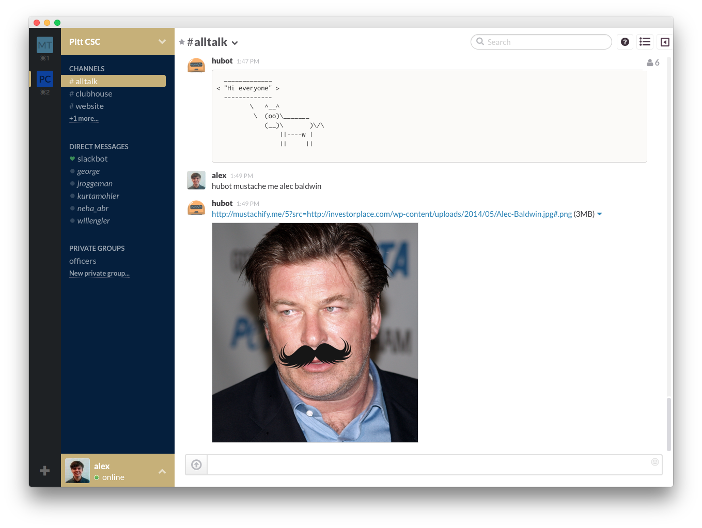

# [fit] Welcome!

## Pitt CSC Meeting
## September 8, 2014

---

# [fit] Github

### [fit] Why it's cool and why we're using it

---

^
- Github is a Website that lets you store your projects in a safe place online
  and share them with other people
- We'll be focusing on the "hub" in Github
- Git is a tool for project management, will explain more next week
- Explain what Octocat is

# What is Github?

A great place to...

1. Collaborate with people
2. Store your code
3. Find other people's code

---

^
- All of our projects will live in Github as Open Source Code
- Will remain available for you to reference later on in resumes and stuff
- Allow people in the future to use our projects as a reference
- Allow us to build on top of previous projects as we go forward

# How will we use it?

- Storing projects
- Tracking progress
- Hosting presentations and documents
- Website hosting

---

# What you need to know now

1. Go to Github tonight
2. Make an account
3. Send us your username

---

# [fit] Slack

## Team Collaboration of the _future_

---

^
- Companies big and small all use Slack
- The future of team collaboration
- A marketable trait in and of itself

# Why use Slack?

- Team chat application
- Allows us to receive notifications from _anything_ in one convenient location
- Awesome Mac/iOS/Android/Web app

---

^
We can do all sorts of cool/fun things with Hubot, and club members can add
their own useful scripts

---

# Questions?
